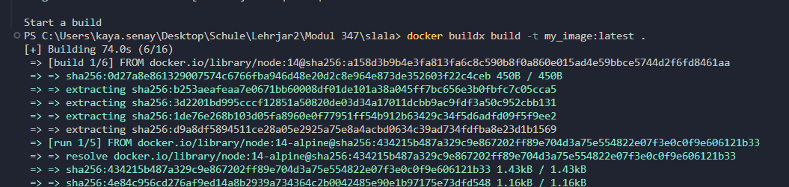
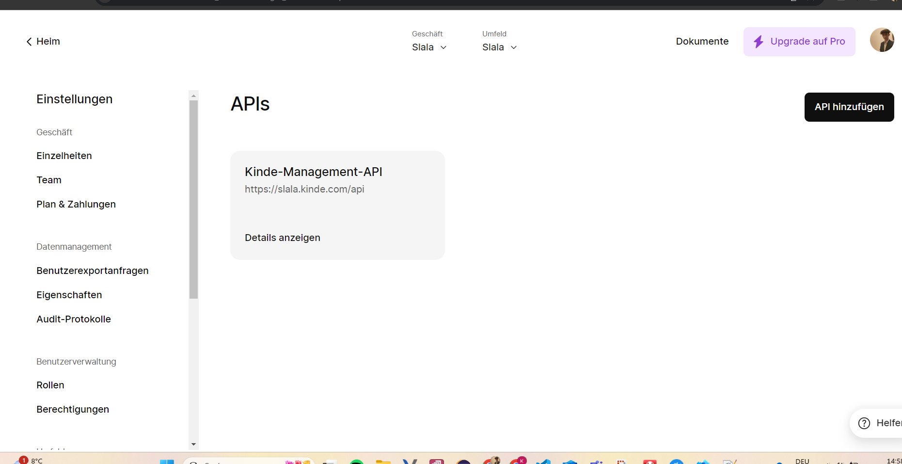
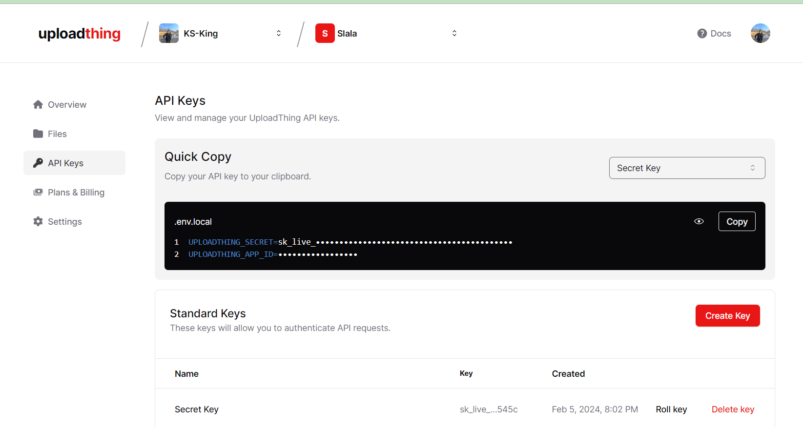
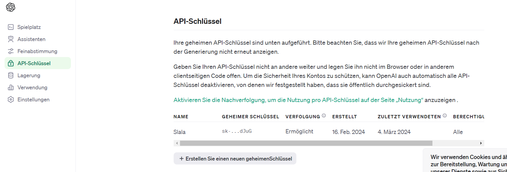

Hier ist ein aktualisiertes README.md für dein Projekt, das auch die zusätzlichen Funktionen und Anleitungen enthält:

```markdown
# Next.js Project

This is a [Next.js](https://nextjs.org/) project bootstrapped with [`create-next-app`](https://github.com/vercel/next.js/tree/canary/packages/create-next-app).

## Getting Started

First, clone the repository:

```bash
git clone -b modul347 https://github.com/King9977/slala.git
cd slala
```

### Opening the Project in a Dev Container

To open the project in a Dev Container, make sure you have Visual Studio Code installed along with the Remote - Containers extension.

1. Open Visual Studio Code.
2. Install the Remote - Containers extension if you haven't already.
3. Open the command palette (Ctrl+Shift+P on Windows/Linux, Cmd+Shift+P on macOS) and select "Remote-Containers: Open Folder in Container".
4. Select the project folder.
5. Wait for the container to build.
6. Once the container is ready, you'll be inside the container's development environment.

### Starting the Development Server

Inside the container's terminal, run:

```bash
npm run dev
# or
yarn dev
# or
pnpm dev
# or
bun dev
```

Open [http://localhost:3000](http://localhost:3000) with your browser to see the result. You can start editing the page by modifying `app/page.tsx`. The page auto-updates as you edit the file.

### Useful VS Code Extensions

While working in the Dev Container, you might find the following VS Code extensions useful:

- [ESLint](https://marketplace.visualstudio.com/items?itemName=dbaeumer.vscode-eslint)
- [Prettier - Code formatter](https://marketplace.visualstudio.com/items?itemName=esbenp.prettier-vscode)

### Debugging Support

You can debug your Next.js application using VS Code's built-in debugger. Make sure to set breakpoints in your code and then start the debugging session.

### Learn More

To learn more about Next.js, take a look at the following resources:

- [Next.js Documentation](https://nextjs.org/docs) - learn about Next.js features and API.
- [Learn Next.js](https://nextjs.org/learn) - an interactive Next.js tutorial.

You can check out [the Next.js GitHub repository](https://github.com/vercel/next.js/) - your feedback and contributions are welcome!

### Deploy on Vercel

The easiest way to deploy your Next.js app is to use the [Vercel Platform](https://vercel.com/new?utm_medium=default-template&filter=next.js&utm_source=create-next-app&utm_campaign=create-next-app-readme) from the creators of Next.js.

Check out our [Next.js deployment documentation](https://nextjs.org/docs/deployment) for more details.

## Additional Features

### Database Integration

This project includes database integration using SQLite.

### Production-ready Containers

Dockerfiles for development and production environments are provided to facilitate easy deployment and scaling.

### Automated Deployment

Use the provided script `deploy.sh` to build and push production images to your Docker Hub account.

### Secure Handling of Sensitive Data

Sensitive data such as passwords is managed using a `.env` file and is not checked into the repository.

### Demo Data

A mechanism is implemented to initialize the database with test data.

### Efficient Alternative Solution

A separate branch is available that uses a pre-configured Dev Container image from Docker Hub for projects with many dependencies.

### One-Click Setup

Use the button below to open the repository in a Dev Container with a single click:

[
    
](https://vscode.dev/redirect?url=vscode://ms-vscode-remote.remote-containers/cloneInVolume?url=https://github.com/King9977/slala.git)

[
](https://vscode.dev/redirect?url=vscode://ms-vscode-remote.remote-containers/cloneInVolume?url=https://github.com/King9977/slala.git)

[
](https://vscode.dev/redirect?url=vscode://ms-vscode-remote.remote-containers/cloneInVolume?url=https://github.com/King9977/slala.git)

Gebe dann später diesen Befehl ein um Docker zu Builden:
docker buildx build -t my_image:latest .




### Erstelle ein KINDE Account
Gehe auf: https://slala.kinde.com

Erstelle dort ein Account und dann gebe im .env file folgendes ein:
KINDE_CLIENT_ID="API KEY"
KINDE_CLIENT_SECRET="API KEY"
KINDE_ISSUER_URL=(Domain)
KINDE_SITE_URL=(Domain)
KINDE_POST_LOGOUT_REDIRECT_URL=(Domain)
KINDE_POST_LOGIN_REDIRECT_URL=(Domain/dashboard)

Gehe auf den Einstellungen und dann bei APIs da findest du alle Daten.


### Erstelle ein UPLOADTHING Account
Gehe auf: https://uploadthing.com/

Erstelle dort ein Account und dann gebe im .env file folgendes ein:
UPLOADTHING_SECRET="API KEY"
UPLOADTHING_APP_ID="API KEY"
Da findest du es die API Keys:



### Erstelle ein OPENAI Account

Gehe auf: https://platform.openai.com
Erstelle ein Account.
Dann gehe auf: https://platform.openai.com/api-keys
Füge den API KEY in dein .env hinzu:
OPENAI_API_KEY="API KEY"
PINECONE_API_KEY"API KEY"



